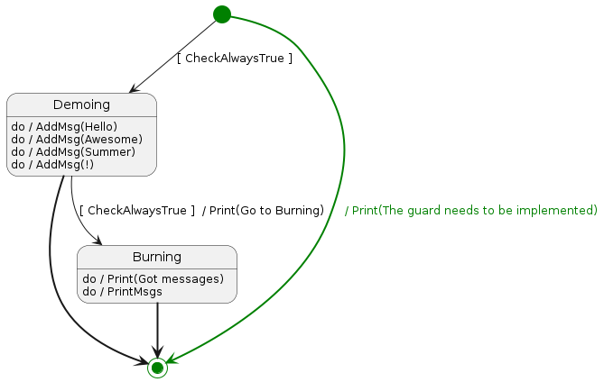

# Getting Started with SC

This guide provides an overview of the features of `sc` and its intended usage to produce high-quality, tested code.

## Prerequisites

### Install SC CLI Tool

Run the following command:

```bash
go install github.com/SoenkeD/sc
```

### Container

Ensure you have a running container environment. Supported options are `Docker` and `Podman`.

### Initialize a Project

Refer to the `readme.md` at the repository's root to initialize a project and run the code for the first time.

### Edit Print Action

To observe initial actions, edit `src/controller/myctl`. 
Replace `// TODO: implement action Print` with:

```golang
log.Println(args[0])
```

Run `make run` again. You should see `The guard needs to be implemented` printed continuously.

### Check the UML File

Open `src/controller/myctl/myctl.plantuml` and locate the line `Print(The guard needs to be implemented)`. The `Print` action executes on a transition from the initial state. Another transition has a guard named `CheckAlwaysTrue`. SC executes transitions in the order defined in the PlantUML file. If a transition without a guard or with a guard that evaluates to true is found, no other guards are tried. The `CheckAlwaysTrue` guard should execute, so there might be an issue with it.

### (Optional) Visually Check the UML

Visualize the state machine path with the `sc path` command. 
First, export the path by customizing the `AfterReconcile` 
behavior in `main.go`:

```golang
type writeRouteJson struct {
	Route []string `json:"route"`
}

type MyReconcileHandler struct {}

func (rh *MyReconcileHandler) React(res controller.CtlRes) bool {
	jBytes, err := json.MarshalIndent(writeRouteJson{Route: res.Route}, "", "    ")
	if err != nil {
		log.Fatal(err)
	}

	log.Println(string(jBytes))

	err = os.WriteFile("route.json", jBytes, 0777)
	if err != nil {
		log.Fatal(err)
	}

	return true
}
```

Modify the reconciler creation in `main.go`:

```golang
reconciler := controller.InitReconciler(ctl, controller.ReconcilerInput{
    AfterReconcileHandler: &MyReconcileHandler{},
})
```

After running `make run`, find `route.json` in the repository's root.
Add the following to the `Makefile` and execute with `make path`:

```Makefile
.PHONY: path
path:
	$(sc) path --root $(PWD) --name myctl --route route.json
```

You should see `myctl.route.plantuml` in the repository's root. 
Render it with PlantUML to visualize the path.



### Edit Guard

In `src/controller/myctl/guards/CheckAlwaysTrue.go`, 
ensure `return true` is executed. 
After running `make run` again,
 the state machine takes a different path, 
but you won't see `Hello World!` yet.


### Work with the State

Implement actions `AddMsg` and `PrintMsgs` to produce output. 
First, add a field to the state in 
`src/controller/myctl/state/ExtendedState.go`:

```golang
package state

type ExtendedState struct {
	Error error
	Route []string

	Messages []string
}
```

Add the message in `src/controller/myctl/actions/AddMsgs.go`:

```golang
state.Messages = append(state.Messages, args[0])
```

Print it in `src/controller/myctl/actions/PrintMsgs.go`:

```golang
log.Println(strings.Join(state.Messages, " "))
```

Run `make run` to see the messages printed.

### Modify the UML

To change printed messages, modify `src/controller/myctl/myctl.plantuml`. 

Replace messages with:

```
Demoing: do / AddMsg(Hello)
Demoing: do / AddMsg(Awesome)
Demoing: do / AddMsg(Summer)
Demoing: do / AddMsg(!)
```

After executing `make run`, the previous output repeats. 
Execute `make sc` and then `make run` to see updated messages.

### To Be Done
- Create another controller
- Customize the controller
- Customize the reconciler
- Error handling
- Panic Handling
- Export to templates
- Setup new imports
- Implement Invariant
- Use Mock-Tests
- Unit Tests
- Integration Tests